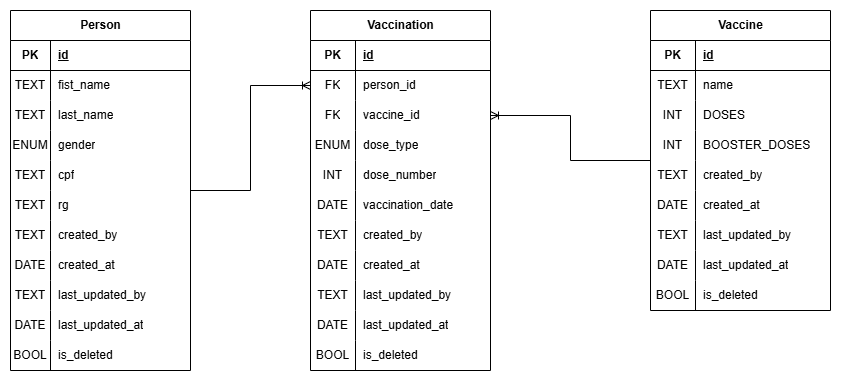

# VaccinationCard API

## Arquitetura

- Não pretendi dividir o sistema em muitos serviços para evitar complexidade. Porém, separar autenticação, API de CRUD e UI em serviços distintos é uma boa decisão, dado que possuem responsabilidades bastante diferentes.

- Inicialmente pensei em utilizar o Amazon Cognito. No entanto, como os usuários serão apenas internos (e os dados de vacinação não podem ser manipulados por qualquer pessoa), a customização dos fluxos de login em serviços como Cognito ou Azure B2C não é tão simples — falo por experiência em ambos. Por isso, optei por implementar um serviço próprio de autenticação baseado em JWT (não necessariamente OAuth 2.0) e reaproveitando as funcionalidades do Microsoft Identity.

- Para garantir escalabilidade, a arquitetura será stateless. Ou seja, não utilizarei sessões (apesar de ser possível usar Redis para isso, não quero adicionar essa complexidade). Também não haverá armazenamento em memória local da instância nem dependências de configurações alteráveis via appsettings em runtime.

- A solução não terá internacionalização; será focada exclusivamente no contexto brasileiro, como uma carteirinha de vacinação do Brasil (sem traduções).

- Logs declarativos e estruturados lançados no stdout (para um sidecar ler do container e enviar para algum destino).


## Tabelas

#### Geral
- todas as tabelas terão tabelas com o mínimo de controle de auditoria, created_by, created_at, last_updated_by, last_updated_at...
- Coluna para **Soft delete**  em todas as tabelas (is_deleted)

#### Person
- Representa uma pessoa no sistema(não necessariamente um usuário)

#### Vaccine
- Cada vacina possui sua própria quantidade de doses e doses de reforço (sem uma tabela extra representando uma dose, preferi fazer o agrupamento pelo código)

#### Vaccination
- A data de input no sistema e a data de aplicação são diferentes, por isso não utilizei a mesma coluna (no caso do sistema ficar offline ou alguma outra ocorrência).
- o tipo de dose (1ª, 2ª, reforço, etc...) vai ser um enum, para ter um controle de valores sem necessidade integridade refencial com uma nova tabela (a quantidade de tipos de doses não vai crescer muito e se crescer, é só adicionar mais uma entrada no enum).

#### Diagrama



## Notas no desenvolvimento

- Nas primeiras funcionalidades foi feito uma maior cobertura de testes unitários automatizados. Conforme o prazo foi da entrega foi se aproximando, a frequência dos testes diminuiu.

- Foi feito o uso de IA da mesma forma que eu utilizo no trabalho, para geração de código boilerplate, revisão de nomes de métodos, sugerir mais cenários de testes do que eu havia previsto e consultas de funcionamento interno de algumas libs. A maior parte do código ainda foi feita a mão e todo código feito pela IA foi devidamente revisadoe todos so conceitos aplicados nesse teste já utilizei em projetos reais.  

- No decorrer do código, há comentários sobre algumas decisões técnicas.

## Tecnologias

- .NET 10
- Entity framework Core 10 
- MediatR
- Fluent Validation
- Serilog
- XUnit
- Swagger
- PostgreSQL

## Padrões

- Utilizei uma estrutura de pastas baseadas na Clean Architecture, CQRS (não no sentido de separar bancos de leitura e escrita) e apliquei o pattern Mediator para reduzir acoplamento entre as camadas. Esses três padrões se complementam muito bem, apesar de deixarem o código mais verboso, fornecem uma separação maior de responsabilidades no código e mais independência entre as classes.

- Segui o princípio de inversão de dependência (SOLID), fazendo com que as classes dependam apenas das interfaces.

- A inversão de dependência foi muito útil na aplicação dos testes automatizados, que foram essenciais para validar o comportamento das classes, mesmo em "edge cases". Por questões de tempo, não pude cobrir 100% dos testes desejados e foquei apenas nos testes unitários.

- Utilizei o Result Pattern. Embora também aumente a verbosidade, já li no Microsoft Learn que exceções devem ser evitadas quando representam erros esperados, pois podem degradar a performance e prejudicar a semântica. Por exemplo, tentar criar um usuário com um e-mail já existente não é uma exceção — é uma validação.

- Utilizei Task sempre que possível para aumentar o throughput da API evitando operações de IO sícrnonas.

- Feito o uso de ORM, em uma abordagem Code First para uam melhor produtividade e coerência entre o código e as tabelas.

- Migrations foram aplicadas para controlar as versões do schema de dados e tornar o schema facilmente replicável.

- Apliquei o Repository Pattern.
O ponto crítico aqui é que o próprio DbContext já atua como um repositório e implementa Unit of Work. As vezes abstrair com um repository pode até reduzir flexibilidade (dependendo da implementação). 
É um trade-off: Ao usar o DbContext direto, quando o projeto cresce, surgem múltiplas repetições de código, dificultando a manutenção ao precisar alterar alguma query (por exemplo, ter que cassar todas as queries para uma entidade porque precisará de um Include).

- Utilizei repositórios genéricos, mas sem forçar o tipo Guid como chave primária. Podemos ter entidades com PKs diferentes. Portanto, a estrutura que eu tuilizei foi:
RepositoryBase<T, Id>.

- Foi feito o uso de DTOs para separar as entidades do domínio e os retornos dos endpoints.

- Value Objects foram utilizados para ficar mais alinhado com o domínio e um modelo de domínio rico (com métodos na própria entidade que validam algumas regras de domínio).

- As rotas da API seguem o padão REST.

- No início de qualquer projeto, Convention Over Configuration é ótimo. Mas conforme o domínio fica mais claro e as regras de negócio começam a mudar, passamos a nos beneficiar mais de um código desacoplado, configurável e coeso, ainda que verboso. Então, neste projeto, vou priorizar controle e clareza em vez de camadas de abstração excessivas.


## Detalhamento

- O algoritmo principal está na classe GetVaccinationCardResponseMapper, que transforma as Vacinações de uma pessoa em uma matriz que representa o cartão de vacinação, facilitando a exibição para o frontend mapeando todas as vacinas (de forma dinâmica), todas as possíveis doses (ordenadas pelo tipo de dose, 1ª, 2ª, 1º reforço, etc...), e uma intersecção entre a dose e a vacina, evidenciando se aquela vacina possui aquela dose (nem todas precisam de 2º reforço por exemplo), se aquela dose foi tomada e em qual data e qual é a dose que esta pendente para a respectiva vacina.

- Utilizarei Minimal APIs. Segundo a Microsoft, elas são mais performáticas e consomem menos recursos do que Controllers, sendo recomendadas para APIs. 

- O Swagger foi utilizado.

- Utilizei o Fluent Validation, para agrupar as validações sem poluir o código. O .NET 10 fornece melhorias em relação as validaçoes nativascom Data Annotations, mas não achei o flexível o suficiente para substituir o Fluent Validation.


- Tanto para o Fluent Validation quanto ao Mediator, utilizei DI automática a partir do assembly do projeto Application (para não poluir o código da classe DependecyInjection)

- Utilizei um hash determinístico para o CPF e para o RG, a idéia é salvar esses dados criptografados ma saina permitir buscas por esses valores.

- Utilizei um log estruturado em JSON e inclui o comportamento de log nas requisições e nas operações de base de dados (inteceptors). O Log em JSON facilita a busca estrutura em platatormas como Cloud Watch Logs, Azure Monitor, EKS, etc...

- Utilizei um interceptor de Auditoria, que utiliza reflection e o contexto da requisição para logar as mudanças na entidade (estado atual e estado anterior), ip do usuário, operação realizada, entre outros detalhes. Por ser uma informação semi estruturada, o resultado está a ser enviado a uma fila "mockada" (possivelmente um consumidor salvaria em um MongoDB).

- As respostas da API utilizam o seu devido status code e os erros são estruturados em um JSON padrão (para facilitar para o front), com detalhes do ocorrido (sem expor brechas).

- Foi utilizado um tratador global de exceção para evitar que exceções retornem ao usuário sem nenhum tratamento.

- Apliquei paginação na listagem de pessoas e uma coluna de pesquisa de nome indexável (índice e buscas LIKE 'termo%'), embora no frontend não tive tempo hábil de implementar essa feature.

- As mensagens de erro não ficaram hardcoded, foram registradas em um resource file que gerou uma classe Messages (camada Common)contendo as mensagens.

## Setup

- O postgreSQL está declarado no container, basta executar ```docker compose up -d``` (ou ```docker-compose up -d``` dependendo da sua versão)

- A API pode ser executada pelo dotnet cli utilizando o comando ```dotnet run --project src/WebAPi --launch-profile https```

- As migrations serão aplicadas automaticamente (apenas porque é ambiente de Dev)

